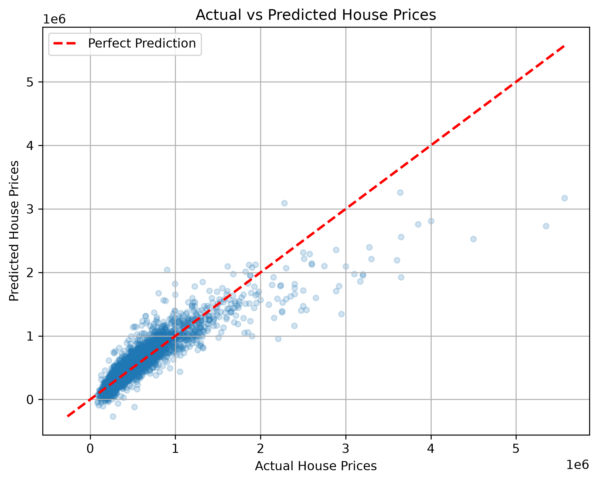
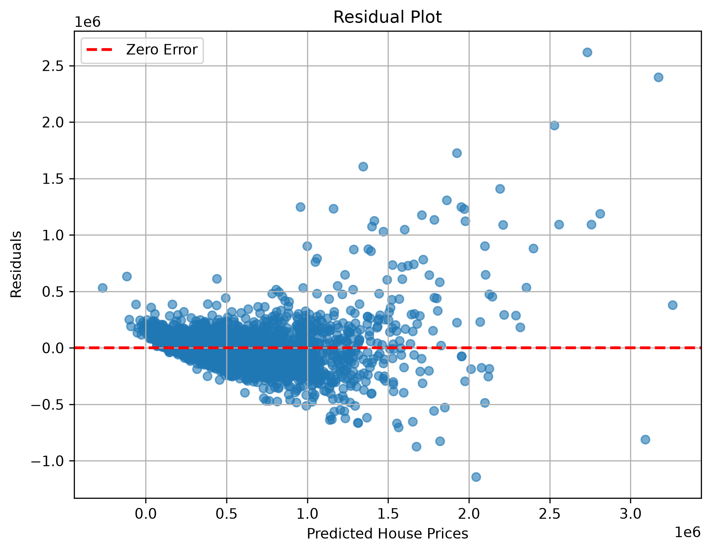
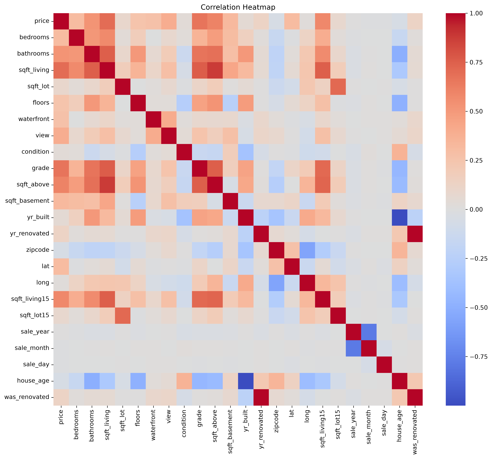

# House Price Prediction — Linear Regression

An end-to-end multiple linear regression model that predicts house prices in King County, built with a clean preprocessing → EDA → modeling → evaluation pipeline.

---

## Overview

This project trains a linear regression model to predict house sale prices from features like living area, grade, location, etc. It covers the full ML workflow: data cleaning, exploratory analysis, feature engineering, categorical encoding, model training, evaluation, and cross-validation.

---

## Results

| Metric                                 | Value                      |
| -------------------------------------- | -------------------------- |
| **R² Score**                    | **0.8068**           |
| **RMSE**                         | **$170,900.96**      |
| **Cross-Validated R² (5-fold)** | **0.8000 ± 0.0190** |

The biggest accuracy gain came from **one-hot encoding `zipcode`** (treating location as categories rather than simple numbers), which lifted R² from 0.70 initially to 0.81.

### Actual vs Predicted



### Residual Plot



---

## Dataset

- **Source:** King County House Sales dataset
- **Size:** 21,613 houses, 24 features after preprocessing
- **Target:** `price`

---

## Project Structure

```
house_price_prediction_model/
├── data/
│   ├── raw/                # original dataset
│   └── processed/          # cleaned dataset
├── src/
│   ├── preprocessing.py    # cleaning + feature engineering
│   ├── eda.py              # correlation analysis
│   └── train_model.py      # split, train, save
├── evaluation.py           # metrics + plots
├── main.py                 # runs the full pipeline
├── models/                 # saved model (.pkl)
├── images/                 # heatmap, actual-vs-predicted, residuals
├── reports/                # dataset, preprocessing, model, evaluation, journal
└── requirements.txt
```

---

## How to Run

```bash
# 1. Install dependencies
pip install -r requirements.txt

# 2. Run the full pipeline
python main.py
```

This cleans the data, runs the EDA, trains the model, evaluates it, saves the model to `models/`, and writes plots to `images/`.

---

## Workflow

1. **Preprocessing** — drops identifiers, splits date into parts, engineers `house_age` and `was_renovated`, and median-imputes missing values.
2. **EDA** — correlation heatmap helps to identify all the key price drivers (`sqft_living`, `grade`, `sqft_above`).
3. **Encoding** — one-hot encode `zipcode` so that the location is treated as categories.
4. **Modeling** — `LinearRegression` on an 80/20 split.
5. **Evaluation** — MSE, RMSE, R², actual-vs-predicted and residual plots.
6. **Validation** — 5-fold shuffled cross-validation to confirm the stability of the model.

### Correlation Heatmap



---

## Tech Stack

Python · pandas · NumPy · scikit-learn · matplotlib · seaborn · joblib

---

## Reports

Detailed write-ups are in [`reports/`](reports/): dataset audit, preprocessing, model, evaluation, and a development journal documenting the full build.

---

## Author

**Garv Bhardwaj**

---
